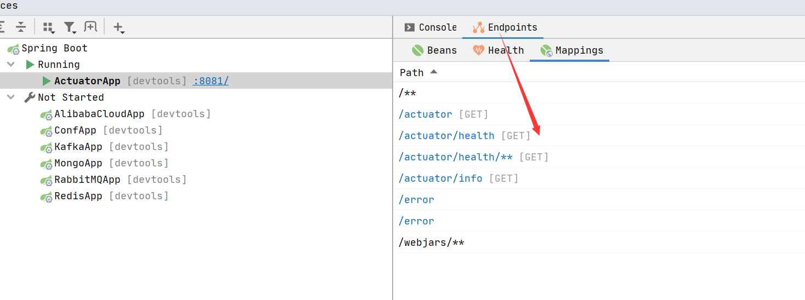

# actuator主要是做监控
[一个英文教程](https://www.bilibili.com/video/BV1RC4y1p7wN?from=search&seid=15101619264676272548)
# EndPoint管理    

如果你是用IDEA商业版，你将可以看到SpringBoot暴露出的EndPoint的Http地址。详细不做介绍了，反正就是可以通过Http暴露监控信息。但是这样做的场景并不多。
# Metrics 
Java常用的Metrics库
* [dropwizard/metrics](https://github.com/dropwizard/metrics) ,Flink Samza等大数据处理框架中所使用的Metrics库。
* [micrometer-metrics](https://github.com/micrometer-metrics/micrometer), SpringBoot2中所使用的Metrics库。


## docker 环境
1. docker安装 influxDb
```bash
docker run -d --name influx -p 8086:8086 influxdb
```
2. docker安装Grafana
```bash
docker run -d --name=grafana -p 3000:3000 grafana/grafana
```
3. docker 安装Prometheus
```text
docker run --name prometheus -d -p 9090:9090 prom/prometheus
```
>> SpringBoot 开箱即用的 InfluxDb（免费，性能高，没有分布式，push模式）和Prometheus（功能多，可分布式，pull模型）。DataDog,New Relic是需要收费的。Graphite太丑了。WaveFront没找到资料
## 禁用SpringBoot Actuator中Http监控，JMX监控。
```yaml
management:
# http 
  server:
    port: -1
# JMX
  endpoints:
    jmx:
      exposure:
        exclude: "*"

```
## InfluxDb + Grafana Metrics 监控

### 自定义Metrics
装配注册中心。
```java
@Bean
MeterRegistryCustomizer<MeterRegistry> metricsCommonTags() {
    return registry -> registry.config().commonTags("region", "us-east-1");
}
```
在IOC容器中使用
```java
@Component
public class SampleBean {

    private final Counter counter;

    public SampleBean(MeterRegistry registry) {
        this.counter = registry.counter("received.messages");
    }

    public void handleMessage(String message) {
        this.counter.increment();
        // handle message implementation
    }

}
```
## Prometheus + Grafana Metrics监控SpringBoot

1. docker安装Prometheus + Grafana


* 监控Controller OR Service
```java
@Timed
// 注解即可
```

# 参考
[SpringBoot监控对比](https://hacpai.com/article/1577185696409)  
[SpringBoot整合InfluxDb](https://www.dazhuanlan.com/2019/08/17/5d5774af8c8c8/?__cf_chl_jschl_tk__=fd9c38c5f9630a029ed92ce117fada5720c0a026-1590557100-0-AfuadPYpx4i-9Zzmv8JN4M2hhsG6GvCcLNQ2jTYMfQerlGicufFp9aqND7HzkjWHjpEDRA_Q35fTn8Op2S_EBN7LDLTjBzW_4vxYoHWeL-WOdvrbiEHO6QWKaiyhrpyGnB5sgURanKM0dRJxk51v-phW2r3jO1RH2miNOxGqyrgbnyhxwoi82KRQ5th1bwo0j5io1RlkMQ-RabDq81-5ySX9axFsGeMA74td3N2AO0cg_aUJdSNa1zRdpU0nLjwnYuFfboFWyoikiZOZsjbPP1xolUYQkYc77e2w5gjWBPHw2hwFz93QMbpOBYPhAhf07Q)  
[Spring Actuator](https://docs.spring.io/spring-boot/docs/2.3.0.RELEASE/reference/html/production-ready-features.html#production-ready)  
[SpringBoot中的Metrics框架](https://www.cnblogs.com/rolandlee/p/11343848.html)    
[Http接口的暴露](https://blog.csdn.net/yaomingyang/article/details/84035975)
# 时序数据库总结

