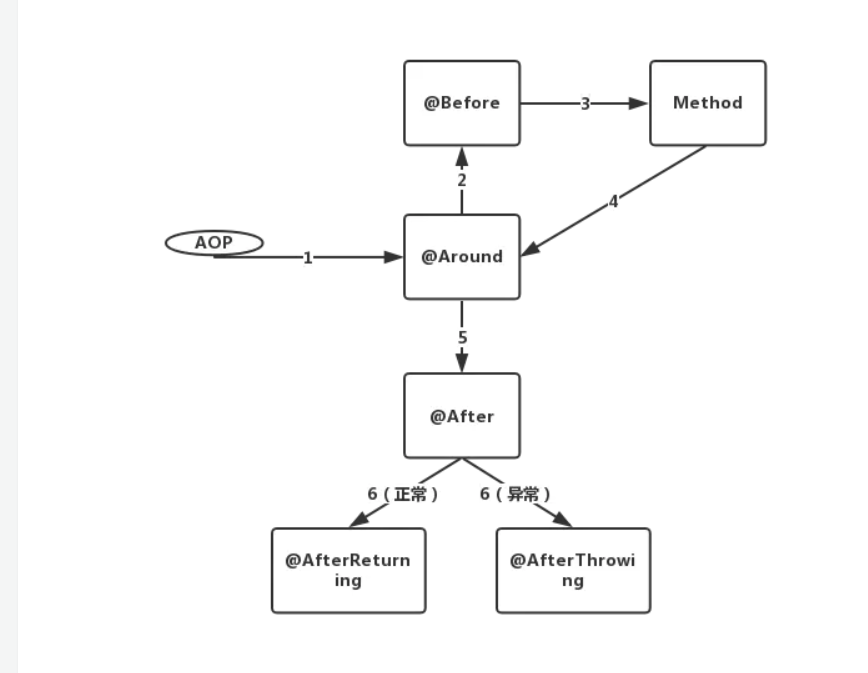

# SpringBoot整合AOP
## 术语解释
- Aspect: 方面，是一个描述AOP行为的文档，可以是基于@Aspect注解的Java类，或者基于XML AOP Spring配置文件。 体现为java代码如下
```java
@Component
public class AopWithAnnatation {
   
}
```
- Join Point: 连接点，具体切入的一点，比如方法，代码某一行。
- Advice: 建议，在Joint Point需要执行的一系列动作。种类主要有 Before,After returning,After throwing, After Finally, Around advice（围绕建议）。顺序为
```text
around before advice
before advice
Join Point
around after advice
after advice
after Throwing
after Returning
```

- Pointcut: 切入点，主要是一种表达式，表示AOP切入情况。
>> 关于声明PointCut的学习资料在参考里面
- Introduction:简介, 定义AOP的唯一ID
- Target object: 目标对象，理解为Advice + Join Point + PointCut。
- AOP proxy：默认为JDK动态代理。
- Weaving：编制，理解为最后AOP字节码生成过程。


# 参考资料
[AOP基本概念](https://www.jianshu.com/p/e6909b4e5d11)  
[Spring AOP官方DOC](https://docs.spring.io/spring-framework/docs/current/spring-framework-reference/core.html#aop-introduction-defn)    
[AOP SpringBoot 参考](https://juejin.im/post/6844903766035005453)  
[aspect关键字](https://my.oschina.net/itblog/blog/208067)      
[aop advice 执行顺序](https://juejin.im/post/6844903969433583624)   
[PointCut Aspect编程指南](https://www.eclipse.org/aspectj/doc/released/progguide/index.html)  
[PointCut Aspect5开发人员笔记](https://www.eclipse.org/aspectj/doc/released/adk15notebook/index.html)
