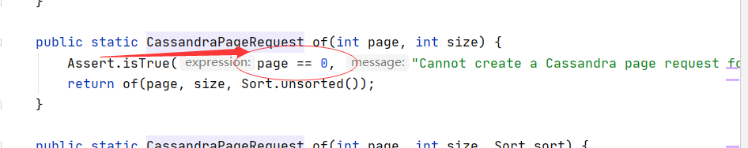

# SpringBoot 整合 Cassandra 

# Docker 单机 Cassandra 
```text
  docker run  -d \
    --restart always \
    --name cassandra-db \
    --hostname cassandra-db \
    -p 9042:9042 \
    -p 9160:9160 \
    -p 7199:7199 \
    -p 7001:7001 \
    -p 7000:7000 \
    -e CASSANDRA_START_RPC=true \
    cassandra:latest
```
```sql
CREATE KEYSPACE user_key_space WITH REPLICATION = { 'class' : 'SimpleStrategy', 'replication_factor' : 1 };
CREATE TABLE user_key_space.user (id TimeUUID PRIMARY KEY, name text, surname text, age int);
	CREATE INDEX usernameindex ON user_key_space.user (name);
	CREATE INDEX usersurnameindex ON user_key_space.user (surname);
	CREATE INDEX userageindex ON user_key_space.user (age);
```
# Pojo Dao 
看代码，和Jpa Mongo很类似

# 单测
```java
  @Autowired
    private UserDao userDao;

    @Test
    void test1() {
        List<User> all = userDao.findAll();
        assertThat(all.isEmpty()).isFalse();
    }

    @Test
    void pageRequest() {
        Slice<User> all = userDao.findAll(CassandraPageRequest.of(0, 100));
        assertThat(all.isEmpty()).isFalse();
    }
```

# 分页的坑

估计Cassandra底层大量的链结构，所以分页查询必须从零开始，必须第一页开始翻，比如
```java
CassandraPageRequest pageCondition = CassandraPageRequest.of(0, pageSize);
Slice<Event> result = Dao(pageCondition)
Slice resultContainer = getFinalPage(pageIndex, result).getContent();


    private Slice getFinalPage(Integer pageIndex, Slice<Event> slice) {
        Slice resultSlice = null;
        if (pageIndex != 0 && slice.hasNext()) {
            for (int i = 1; i < pageIndex; i++) {
                if (slice.hasNext()) {
                    resultSlice = Dao.findAll(slice.nextPageable());
                } else {
                    break;
                }
            }
            return resultSlice;
        } else {
            return slice;
        }
    }

```