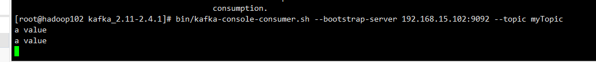

# SpringBoot整合Kafka
### YAML配置
```yaml
spring:
  kafka:
    consumer:
      bootstrap-servers: 192.168.15.102:9092 # 消费者Kakfa地址
      enable-auto-commit: false # 不自动提交offset
      group-id: test-group # 消费者组
      auto-offset-reset: earliest #offset自动重置为最早的
    producer:
      bootstrap-servers: 192.168.15.102:9092
      # key-serializer:  指定Key的序列化类
      # value-serializer:  指定Value的序列化类
    bootstrap-servers: 192.168.15.102:9092

```

### QuickStart
```bash
bin/kafka-topics.sh --create --bootstrap-server 192.168.15.102:9092 --replication-factor 1 --partitions 1 --topic myTopic
```
一个小案例
```java
    @Autowired
    private KafkaTemplate<String, String> template;

    private final CountDownLatch latch = new CountDownLatch(3);

    @Override
    public void run(String... args) throws Exception {
        this.template.send("myTopic", "foo1");
        this.template.send("myTopic", "foo2");
        this.template.send("myTopic", "foo3");
        latch.await(60, TimeUnit.SECONDS);
        log.info("All received");
    }

    @KafkaListener(topics = "myTopic")
    public void listen(ConsumerRecord<?, ?> cr) throws Exception {
        log.info(cr.toString());
        latch.countDown();
    }
```

### 发消息
com.maodun.producer.TemplateSenderTest
```java
     @Autowired
     private KafkaTemplate kafkaTemplate;
 
 
     /**
      * 发送一条消息
      */
     @Test
     public void sendOne() {
         ProducerRecord producerRecord = new ProducerRecord("myTopic", 0, System.currentTimeMillis(), "a key", "a value");
 
         /**
          * 异步回调
          */
         ListenableFuture send = kafkaTemplate.send(producerRecord);
         send.addCallback(new ListenableFutureCallback() {
             @Override
             public void onFailure(Throwable throwable) {
                 log.error("--------send fail------------");
             }
 
             @Override
             public void onSuccess(Object o) {
                 log.error("--------send success------------");
             }
         });
 
         // 同步
 
         try {
             kafkaTemplate.send(producerRecord).get(10, TimeUnit.SECONDS);
             log.error("--------send success------------");
         } catch (InterruptedException e) {
             e.printStackTrace();
         } catch (ExecutionException e) {
             e.printStackTrace();
         } catch (TimeoutException e) {
             e.printStackTrace();
         }
     }
```
```bash
bin/kafka-console-consumer.sh --bootstrap-server localhost:9092 --topic myTopic --from-beginning
```
发送成功

### 收消息

#### @KafkaListener 注解配置
注解有很多配置参数，包括分区啊啥的。有兴趣可以自己去看下。
```java
    @KafkaListener(topics = "myTopic")
    public void LisenerDemo(ConsumerRecord<?, ?> record, Acknowledgment ack) {
        log.info(record.value().toString());
    }
```

### 事务
@Transactional注解即可