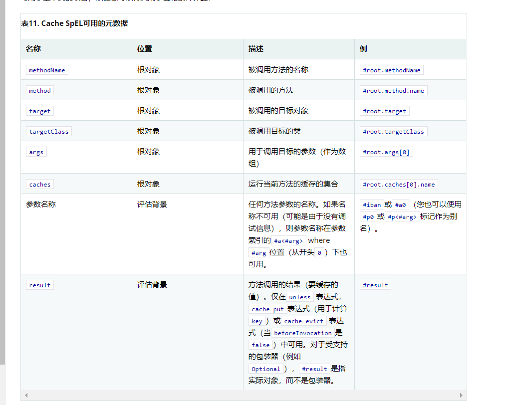
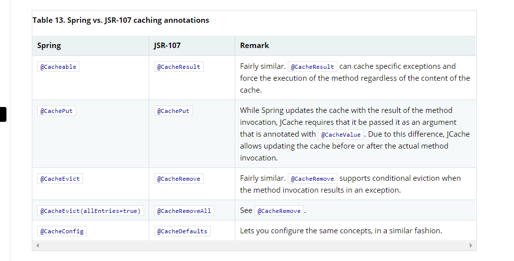

# SpringBoot 整合本地缓存
# 说明
* 如果你没有添加任何第三方缓存，Spring将默认启动一个ConcurrentHashMap缓存容器，并且可以配置多个ConcurrentHashMap缓存容器。
```yaml
spring:
  cache:
    cache-names: cache1,cache2
```
* 缓存后端加载顺序

* 如何手动指定本地缓存后端
```yaml
spring:
  cache:
    type: 指定
```
* 关于Caffeine的yaml配置，以下配置创建cache1和cache2缓存的最大大小为500，生存时间为 10分钟
```yaml
spring:
  cache:
    cache-names: cache1,cache2
    caffeine:
      spec: maximumSize=500,expireAfterAccess=600s
```
# 直接使用最强本地缓存 caffeine
* 依赖以及JavaConf
```xml
    <dependency>
       <groupId>org.springframework.boot</groupId>
       <artifactId>spring-boot-starter-cache</artifactId>
    </dependency>
    <dependency>
       <groupId>com.github.ben-manes.caffeine</groupId>
       <artifactId>caffeine</artifactId>
    </dependency>
```
```java
    
```
# 缓存功能的开关
## 开
```java
@EnableCaching
```
## 关
```yaml
spring:
  cache:
    type: none
```
# 注解使用
## @Cacheable 注解
* 指定缓存名字
```java
@Cacheable(cacheNames = "test")
```
* 指定Hash函数参数，可以使用SPEL语言，默认使用方法所有参数，作为Hash函数的入参。
```java
@Cacheable(cacheNames="books", key="#isbn")
public Book findBook(ISBN isbn, boolean checkWarehouse, boolean includeUsed)

@Cacheable(cacheNames="books", key="#isbn.rawNumber")
public Book findBook(ISBN isbn, boolean checkWarehouse, boolean includeUsed)

@Cacheable(cacheNames="books", key="T(someType).hash(#isbn)")
public Book findBook(ISBN isbn, boolean checkWarehouse, boolean includeUsed)
```
* 指定缓存管理器， 实现 CacheManager接口。
```java
@Cacheable(cacheNames="books", cacheManager="anotherCacheManager") 
public Book findBook(ISBN isbn) {...}
```
* 指定缓存解析器， 实现 CacheResolver接口。
```java
@Cacheable(cacheResolver="runtimeCacheResolver") 
public Book findBook(ISBN isbn) {...}
```
* 同步缓存，及线程安全
```java
@Cacheable(cacheNames="foos", sync=true) 
public Foo executeExpensiveOperation(String id) {...}
```
* 条件性缓存
```java
@Cacheable(cacheNames="book", condition="#name.length() < 32") 
public Book findBook(String name)
```
* Cache中可以用的SPEL根元素

## @CachePut 
* 将返回值存放至Cache中，注意不要将@CachePut和@Cacheable一同使用。
```java
@CachePut(cacheNames="book", key="#isbn")
public Book updateBook(ISBN isbn, BookDescriptor descriptor)
```
## @CacheEvict
* 将缓存内所有数据清除
```java
@CacheEvict(cacheNames="books", allEntries=true) 
public void loadBooks(InputStream batch)
```
## @Caching
* 复合注解
```java
@Caching(evict = { @CacheEvict("primary"), @CacheEvict(cacheNames="secondary", key="#p0") })
public Book importBooks(String deposit, Date date)
```
## @CacheConfig 
* 用类级别的注解
```java
@CacheConfig("books") 
public class BookRepositoryImpl implements BookRepository {

    @Cacheable
    public Book findBook(ISBN isbn) {...}
}
```
# 自定义注解
```java
@Retention(RetentionPolicy.RUNTIME)
@Target(ElementType.METHOD)
@CacheEvict(cacheNames = "demoOne", allEntries = true)
public @interface UdfEvict {
}
```
# JSR-107 注解使用 (建议不要与Spring的注解混用)
* 映射关系


# 参考 
[caffeine git and wiki](https://github.com/ben-manes/caffeine)
