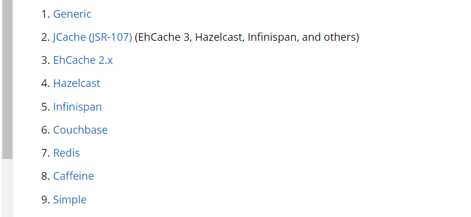

# SpringBoot 整合本地缓存
# 说明
* 如果你没有添加任何第三方缓存，Spring将默认启动一个ConcurrentHashMap缓存容器，并且可以配置多个ConcurrentHashMap缓存容器。
```yaml
spring:
  cache:
    cache-names: cache1,cache2
```
* 缓存后端加载顺序

* 如何手动指定本地缓存后端
```yaml
spring:
  cache:
    type: 指定
```
* 关于Caffeine的yaml配置，以下配置创建cache1和cache2缓存的最大大小为500，生存时间为 10分钟
```yaml
spring:
  cache:
    cache-names: cache1,cache2
    caffeine:
      spec: maximumSize=500,expireAfterAccess=600s
```
# 直接使用最强本地缓存 caffeine
* 依赖以及JavaConf
```xml
    <dependency>
        <groupId>org.springframework.boot</groupId>
        <artifactId>spring-boot-starter-cache</artifactId>
    </dependency>
```
```java
    
```
# 缓存功能的开关
## 开
```java
@EnableCaching
```
## 关
```yaml
spring:
  cache:
    type: none
```
# 注解使用

# 自定义注解
# JSR-107 注解使用 (建议不要与Spring的注解混用)


# 参考 
[caffeine git and wiki](https://github.com/ben-manes/caffeine)
