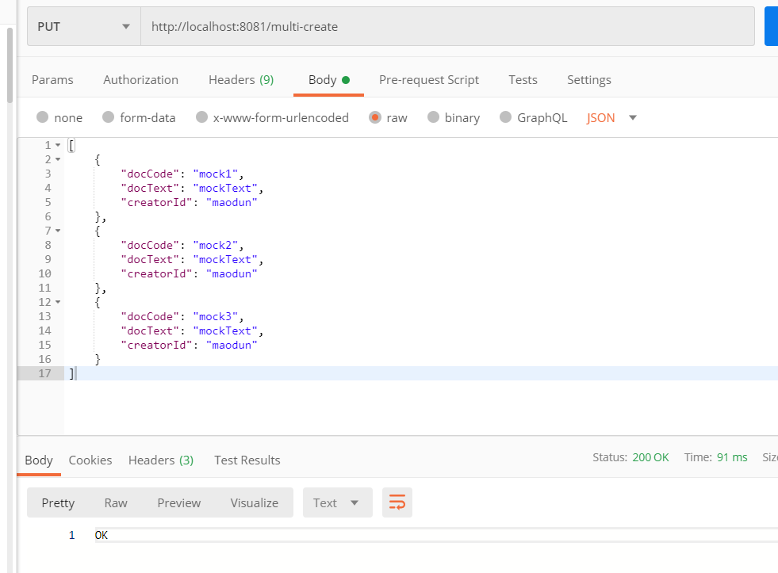
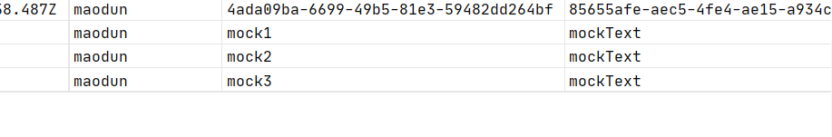
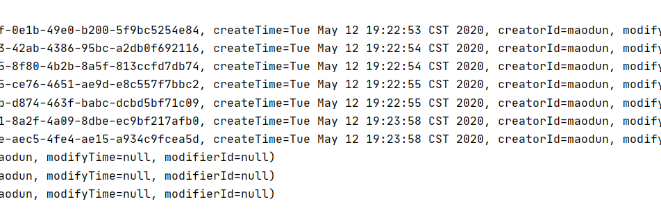
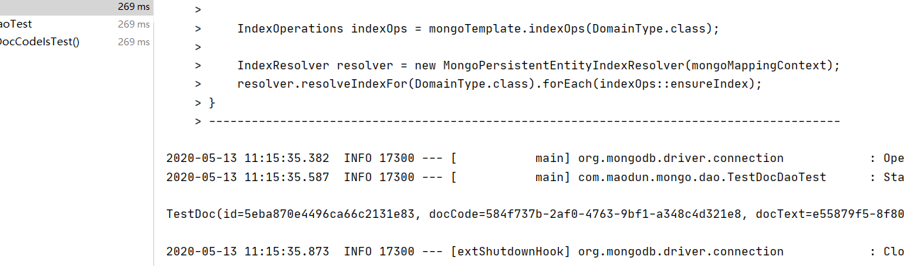
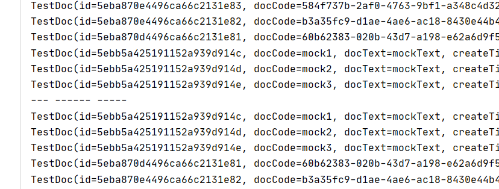

# SpringBoot整合Mongo，整合内嵌Mongo

## 内嵌 Mongo 用于单元测试


## Mongo 关于MongRepositry
### 不用建表，先配置YAML文件
```yaml
# mongo配置
spring:
  data:
    mongodb:
      uri: mongodb://192.168.15.102:27017
      database: myDB
      username: admin
      password: 123456
      auto-index-creation: on #自动创建索引
      field-naming-strategy: org.springframework.data.mapping.model.SnakeCaseFieldNamingStrategy # 字段映射关系， 如TestDoc映射为testDod表，creatorId映射为creator_id
      # authentication-database: 认证服务器地址
      # grid-fs-database: grid-fs地址

  jackson:
    # 时区，字符串格式化
    time-zone: GMT+8
    date-format: "yyyy-MM-dd HH:mm:ss"
```
### 依次定义Pojo,Dao,Service,Controller
参考代码,SpringData将根据Pojo自动生成对应Mongo表，无须手动建表。

### Create操作
* 插入一个字段
```java
TestDoc testDoc = new TestDoc();
Date time = new Date();
testDoc.setCreateTime(time);
testDoc.setCreatorId("maodun");
testDoc.setDocCode(UUID.randomUUID().toString());
testDoc.setDocText(UUID.randomUUID().toString());
testDocDao.insert(testDoc);
```
* 测试索引是否生效 （docCode是已经存在于表中字段），结果是生效的。   
postman header   
```text
Content-type application/json
```
模拟数据   
```json
{
	"docCode" : "ad45e22b-67f4-4276-8830-ae5ea0a0e7ce",
	"docText": "maodunNumberOne"
}
```


* 插入多个Pojo （通过）    
模拟数据   
```json
[
    {
        "docCode": "mock1",
        "docText": "mockText",
        "creatorId": "maodun"
    },
    {
        "docCode": "mock2",
        "docText": "mockText",
        "creatorId": "maodun"
    },
    {
        "docCode": "mock3",
        "docText": "mockText",
        "creatorId": "maodun"
    }
]
```

```java
    @PutMapping("/multi-create")
    public ResponseEntity createMulti(@RequestBody String multipleJson) throws JsonProcessingException {
        CollectionType collectionType = objectMapper.getTypeFactory().constructCollectionType(List.class, TestDoc.class);
        List<TestDoc> testDocs = (List<TestDoc>) objectMapper.readValue(multipleJson, collectionType);
        List<TestDoc> result = testDocDao.insert(testDocs);
        if (result != null) {
            return ResponseEntity.ok("OK");
        } else {
            return ResponseEntity.badRequest().body("FAILT");
        }
    }
```

  


* [MongoRepository Save和Insert的区别](https://www.cnblogs.com/lanqi/p/8535390.html)   
Save追踪_id主键，并进行已有_id的文档更新，如果没有则插入，而Insert不会执行更新，直接报错。
### Retrieve 操作
* 精准查询
```java
Optional<List<TestDoc>> findByCreatorIdIs(String creatorId);
Optional<TestDoc> findByDocCodeIs(String docCode);
Optional<List<TestDoc>> findByCreatorIdIsOrDocTextIs(String creatorId, String docText);
```
方法名套是 findBy(某某字段)(Is或者In或者IS_NULL等判断逻辑)(And或者Or等逻辑)(某某字段)(Is或者In或者IS_NULL等判断逻辑),[更多方法逻辑名字](https://docs.spring.io/spring-data/mongodb/docs/2.2.7.RELEASE/reference/html/#repository-query-keywords)
,英文的字面意思，如果你是用IDEA商业版，你将获得许多提示。com.maodun.mongo.dao.TestDocDaoTest单元测试结果如下。



* 模糊搜索
```java
  Optional<List<TestDoc>> findByCreatorIdLike(String creatorId);
```
详情请看单元测试。
* 结果排序   
4种方法排序
```java
public interface PersonRepository extends MongoRepository<Person, String> {
    
    // 通过指定By***Sort升序降序
  List<Person> findByFirstnameSortByAgeDesc(String firstname); 
    // 通过传入Sort字段
  List<Person> findByFirstname(String firstname, Sort sort);   
    
    //通过注解，使用MongoShell原生Json
  @Query(sort = "{ age : -1 }")
  List<Person> findByFirstname(String firstname);              

    // 前两种的结合
  @Query(sort = "{ age : -1 }")
  List<Person> findByLastname(String lastname, Sort sort);     
}
```
```java
//我们选择第二种方法
Optional<List<TestDoc>> findByCreatorIdIs(String creatorId, Sort sort);
```
单元测试结果，顺序相反。

* 分页查询
```java
 Page<TestDoc> findByCreatorIdIs(String creatorId, Pageable pageable);
```
详情请看单元测试

* 原生MongoShell Json查询
TODO 

* 聚合查询
TODO    

### Update 
```java

  @Test
    public void updateTest() {
        TestDoc testDoc = new TestDoc();
//注意，一定要传id字段
        Optional<TestDoc> byId = testDocDao.findById("5eba874e86b84e3199b227da");
        if (byId.isPresent()) {
            TestDoc testDoc1 = byId.get();
            BeanUtils.copyProperties(testDoc1, testDoc);
            testDoc.setDocCode("update a docCode3");
        }
        TestDoc save = testDocDao.save(testDoc);
        System.out.println(save);
        Assertions.assertNotNull(save);
    }
```
更新操作会比较简单，先查出来，再更新字段。

### DELETE操作
* 通过_id删除
```java
long deleteByIdIs(String id);
long deleteByDocCodeIs(String docCode);
```

### 事务
Mongo需要4.0以上, mongoDB单个实例不支持事务，副本集才支持事务。
```java
Sessions are not supported by the MongoDB cluster to which this client is connected 通常为单机Mongo，不支持事务。
```
#### 事务资料，文章
 - [Mongo事务](https://blog.csdn.net/ssehs/article/details/105301345)。
 - https://www.jianshu.com/p/7e8f0f437cd0
```text
# 查看Mongo版本
docker 进入容器 docker exec -it 容器标识 /bin/bash
mongod --version
```
配置事务管理器
```java
@Configuration
public class MongoConf  {
    @Bean
    public MongoTransactionManager transactionManager(MongoDbFactory dbFactory) {
        return new MongoTransactionManager(dbFactory);
    }
}

```
使用注解完成事务管理。
```java
  @Transactional(rollbackFor = Exception.class)
    public Long deleteOne(String id) {
        long l = testDocDao.deleteByIdIs(id);
        log.info(" -----------------delete id :{} ----result is :{}" + id + " result " + l);
        int i = 1 / 0;
        return l;
    }
```