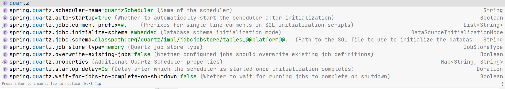

# SpringBoot 整合Quartz
* pom
```xml
   <dependency>
        <groupId>org.springframework.boot</groupId>
        <artifactId>spring-boot-starter-quartz</artifactId>
   </dependency>
```
* 提供的对Quartz的自动装配

* 简单使用
```java
    @Autowired
    private Scheduler scheduler;

    @Override
    public void run(String... args) throws Exception {
        JobDetail demoJob = newJob(DemoQuartzBean.class)
                .withIdentity("k1", "g1")
                .build();
        final SimpleTrigger simpleTrigger = newTrigger()
                .withIdentity("k2", "g1")
                .withSchedule(simpleSchedule().withIntervalInSeconds(10).withRepeatCount(10))
                .build();

        scheduler.scheduleJob(demoJob, simpleTrigger);
    }
```
* 关于Job的自动注入，一种是用@Autowired，一种是构造函数。
```java
import com.maodun.service.Demo;
import com.maodun.service.Demo2;
import lombok.extern.slf4j.Slf4j;
import org.quartz.JobExecutionContext;
import org.quartz.JobExecutionException;
import org.springframework.beans.factory.annotation.Autowired;
import org.springframework.scheduling.quartz.QuartzJobBean;

@Slf4j
public class DemoQuartzBean extends QuartzJobBean {

//    private Demo demo;
//    private Demo2 demo2;
//    public DemoQuartzBean(Demo demo, Demo2 demo2) {
//        this.demo = demo;
//        this.demo2 = demo2;
//    }

    @Autowired
    private Demo demo;
    @Autowired
    private Demo2 demo2;

    @Override
    protected void executeInternal(JobExecutionContext jobExecutionContext) throws JobExecutionException {
        log.info("this is quartzBean Task");
        demo.hello();
        demo2.hello();
    }
}
```

# 参考
[SpringBoot原生QuartzJobBean的用法](https://www.hangge.com/blog/cache/detail_2699.html)
[SpringBoot原生QuartzJobBean2](https://juejin.im/post/5dc6d4ddf265da4d1f51c9c1)
[SpringBoot原生QuartzJobBean 3](https://juejin.im/post/5d3e9c5d6fb9a07ed6581bb8)
[SpringBoot 定时任务技术选型](https://segmentfault.com/a/1190000022876246)
