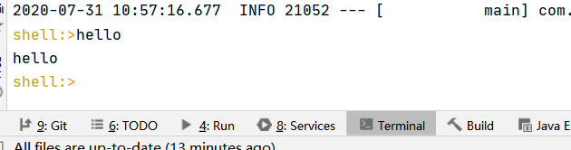
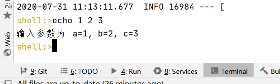

# SpringBoot 开发Shell 应用
```xml
    <dependency>
        <groupId>org.springframework.boot</groupId>
        <artifactId>spring-boot-starter</artifactId>
    </dependency>

    <dependency>
        <groupId>org.springframework.shell</groupId>
        <artifactId>spring-shell-starter</artifactId>
        <version>2.0.0.RELEASE</version>
    </dependency>
```
* spring-shell 主要是简化命令行程序开发，让你更加专注于实现。
# hello-world
```java
@ShellComponent
public class HelloCommands {

    @ShellMethod("输出Hello")
    public String hello() {
        return "hello";
    }
}
```
* package 后，java -jar **.jar，在命令行中输入。

* 多参数输入
```java
    @ShellMethod(value = "多参数输入")
    public String echo(int a, int b, int c) {
        return String.format("输入参数为 a=%d, b=%d, c=%d", a, b, c);
    }
```



# 中文参考
[一个非常详细的](https://www.cnblogs.com/nuccch/p/11067342.html)