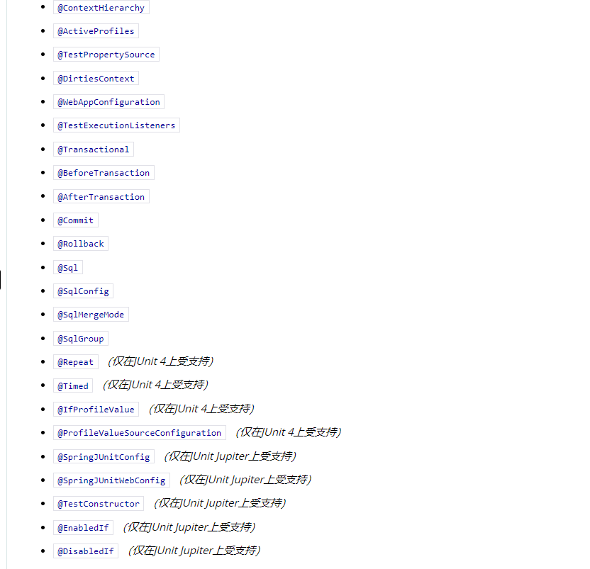

# SpringBoot 自动装配的注解
[参考](https://docs.spring.io/spring-boot/docs/current/reference/html/appendix-test-auto-configuration.html#test-auto-configuration)
# Junit4 注解
```java
@IfProfileValue

@ProfileValueSourceConfiguration

@Timed 超时

@Repeat 重复调用
```
# JUnit Jupiter 注解
```java
@SpringJUnitConfig

@SpringJUnitWebConfig

@TestConstructor

@EnabledIf

@DisabledIf
```
注解图
