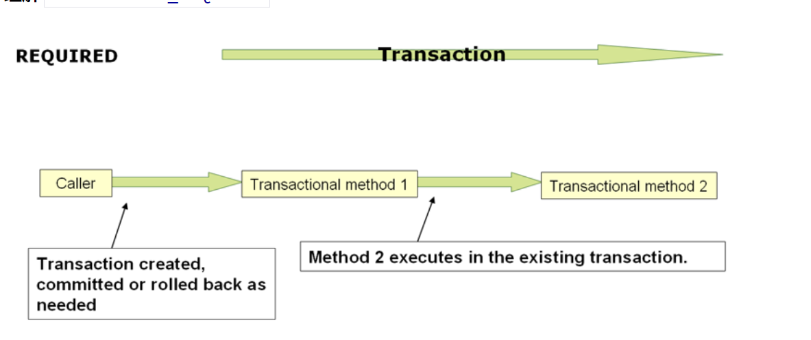
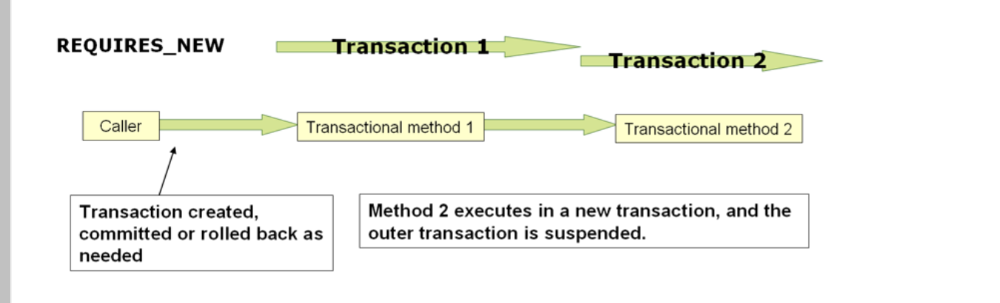

# SpringBoot 中的事务
* 环境准备
```xml
<dependency>
    <groupId>mysql</groupId>
    <artifactId>mysql-connector-java</artifactId>
    <scope>runtime</scope>
</dependency>
<dependency>
    <groupId>org.springframework.boot</groupId>
    <artifactId>spring-boot-starter-data-jpa</artifactId>
</dependency>
```
```yaml
spring:
  datasource:
    url: jdbc:mysql://192.168.30.102:3306/test
    driver-class-name: com.mysql.cj.jdbc.Driver
    username: root
    password: 123
  jpa:
    # 自动根据Pojo生成mysql表数据
    generate-ddl: on
```
## 注解事务
* Transactional 注解
```java
@Service
public class DemoServiceImpl implements DemoService {
    @Autowired
    private DemoDao demoDao;

    /**
     * 当没有Transactional注解时，数据库将会插入成功
     * 当有Transactional注解时，数据会插入失败
     *
     * @param demo
     * @return
     */
    @Override
    @Transactional
    public boolean saveDemo(Demo demo) {
        demoDao.save(demo);
        throw new NullPointerException();
    }

   
}
```
* Transactional 注解参数详解
```text
    /*
     * 指定事务管理器Bean，通过唯一Id
    */
    @AliasFor("transactionManager")
    String value() default "";

    @AliasFor("value")
    String transactionManager() default "";
    
    /*
    * 指定事务传播级别
    */
    Propagation propagation() default Propagation.REQUIRED;
    
    /*
    * 指定事务隔离级别
    */
    Isolation isolation() default Isolation.DEFAULT;
    
     /*
       * 指定事务超时时间
     */
    int timeout() default -1;
    
        
     /*
       * 指定事务级别 https://blog.csdn.net/andyzhaojianhui/article/details/51984157
     */
    boolean readOnly() default false;
    
    /*
     * 通过Class对象，指定回滚的异常类
    */
    Class<? extends Throwable>[] rollbackFor() default {};

    /*
     * 通过Class名数组，指定回滚的异常类名
    */
    String[] rollbackForClassName() default {};

    /*
     * 与rollbackFor相反
    */
    Class<? extends Throwable>[] noRollbackFor() default {};

    /*
     * 与rollbackForClassName相反
    */
    String[] noRollbackForClassName() default {};
```
## 编程事务
* TransactionTemplate 线程安全，如果对于不同隔离级别的事务，需要创建多个TransactionTemplate
```text
    
    @Autowired
    private TransactionTemplate transactionTemplate;

   @Override
    public boolean saveDemo1(Demo demo) {
        Boolean execute = transactionTemplate.execute(new TransactionCallback<Boolean>() {
            @Override
            public Boolean doInTransaction(TransactionStatus transactionStatus) {
                demoDao.save(demo);
                throw new NullPointerException();
                //return true;
            }
        });
        return execute;
    }
```
* TransactionOperator 不是很好用，不学了。

* TransactionManager 比较常见的，可以自定义管理器，整合Redis和Mysql事务一起。
```text
    @Autowired
    private PlatformTransactionManager platformTransactionManager;

    @Override
    public boolean saveDemo3(Demo demo) {
        DefaultTransactionDefinition def = new DefaultTransactionDefinition();
        def.setName(demo.getId());
        def.setPropagationBehavior(TransactionDefinition.PROPAGATION_REQUIRED);
        TransactionStatus status = platformTransactionManager.getTransaction(def);
        try {
            demoDao.save(demo);
            throw new NullPointerException();
        } catch (NullPointerException e) {
            e.printStackTrace();
            platformTransactionManager.rollback(status);
            return false;
        }
//        platformTransactionManager.commit(status);
//        return true;
    }
```
## 事务结束回调Hook
```java
@Component
public class MyComponent {

    @TransactionalEventListener
    public void handleOrderCreatedEvent(CreationEvent<Order> creationEvent) {
        // ...
    }
}
```
## 事务隔离级别
DEFAULT 使用数据库设置的隔离级别 ( 默认 ) ，由 DBA 默认的设置来决定隔离级别    
READ_UNCOMMITTED 会出现脏读、不可重复读、幻读 ( 隔离级别最低，并发性能高 )   
READ_COMMITTED 会出现不可重复读、幻读问题（锁定正在读取的行）  
REPEATABLE_READ 会出幻读（锁定所读取的所有行）   
SERIALIZABLE 保证所有的情况不会发生（锁表）   
## 事务传播
* 理解：对于@Transactional注解来说，传播意味着方法嵌套中是否需要创建新的事务。
```text
    REQUIRED(0),
    SUPPORTS(1),
    MANDATORY(2),
    REQUIRES_NEW(3),
    NOT_SUPPORTED(4),
    NEVER(5),
    NESTED(6);
```
### REQUIRED 级别 默认事务传播级别
* 如果没有事务则创建事务。
* 当事务传播为REQUIRED级别时，@Transactional修饰的方法，无论嵌套多少层，都只共有一个事务。如图。

### SUPPORTS
* 如果没有事务，不新建事务
### MANDATORY
* 支持当前事务，没有事务则抛异常。
### REQUIRES_NEW 级别
* 新建事务，若当前存在事务，则挂起当前事务。

### NOT_SUPPORTED 
* 不支持事务，有事务则挂起
### NESTED 级别
* 若当前存在事务，则嵌套执行。若没有事务则要求创建事务。
