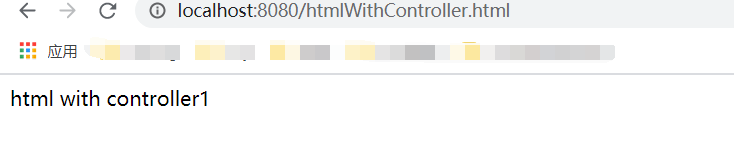
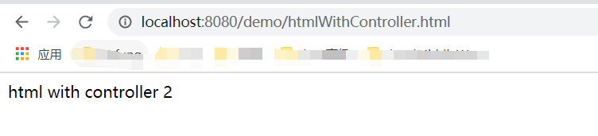
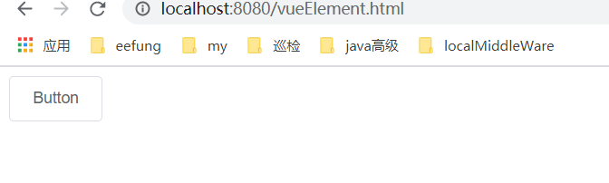

# SpringBoot 整合Vue
## SpringMVC 访问HTML
### 走Controller, 可以定制路由
```java
@Controller
public class HtmlController {
    @GetMapping("/htmlWithController1")
    public String htmlWithController1() {
        return "htmlWithController.html";
    }

    @GetMapping("/htmlWithController2")
    public String htmlWithController2() {
        return "demo/htmlWithController.html";
    }
}
```
### 不走Controller
直接通过通过url后缀html访问


## 不走Node，不走Webpack
#### 离线CDN，一个最简单的 Vue + ElementUI 的页面
1. [下载Vue压缩版](https://cdn.jsdelivr.net/npm/vue)
2. 下载ElementUI的离线CDN  
3. 下载Axios的离线CDN  
案例html
```html
<!DOCTYPE html>
<html lang="en">
<head>
    <meta charset="UTF-8">
    <!-- import CSS -->
    <link rel="stylesheet" href="./css/index.css">
</head>
<body>
<div id="app">
    <el-button @click="visible = true">Button</el-button>
    <el-dialog :visible.sync="visible" title="Hello world">
        <p>Try Element</p>
    </el-dialog>
</div>
</body>
<!-- import Vue before Element -->
<script src="./js/vue.js"></script>
<!-- import JavaScript -->
<script src="./js/index.js"></script>
<script>
    new Vue({
        el: '#app',
        data: function () {
            return {visible: false}
        }
    })
</script>
</html>
```

#### 在线CDN
将资源文件换成CDN即可。如Vue.js资源文件。
```text
<script src="https://unpkg.com/element-ui/lib/index.js"></script>
```
## 走Node，走Webpack
在Vue项目中 
```text
npm run build
```
将Dist文件中的内容拷贝到static文件夹中即可。对静态资源放权。

# 参考
[SpringBoot 静态资源访问](https://blog.csdn.net/qq_36481052/article/details/79075214)